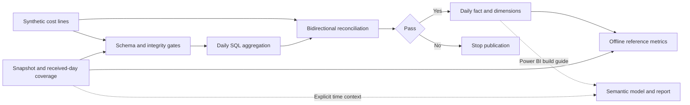
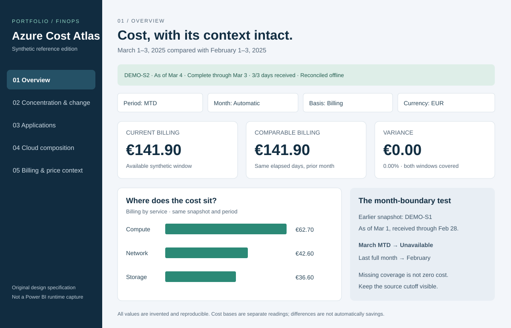
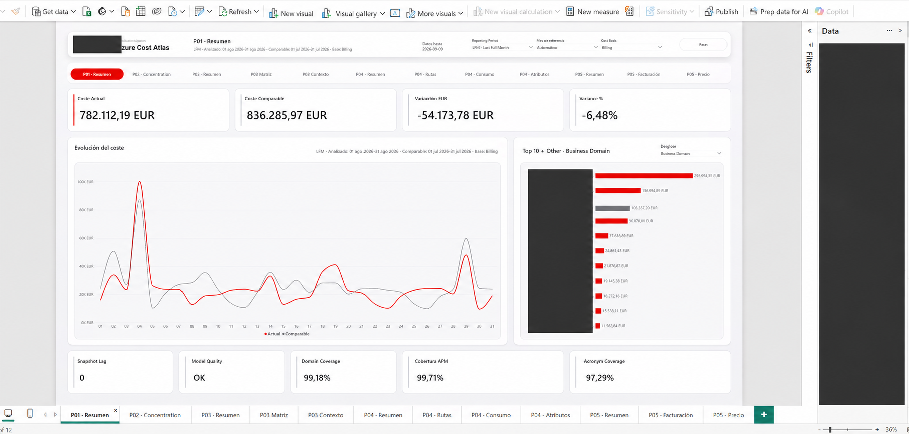
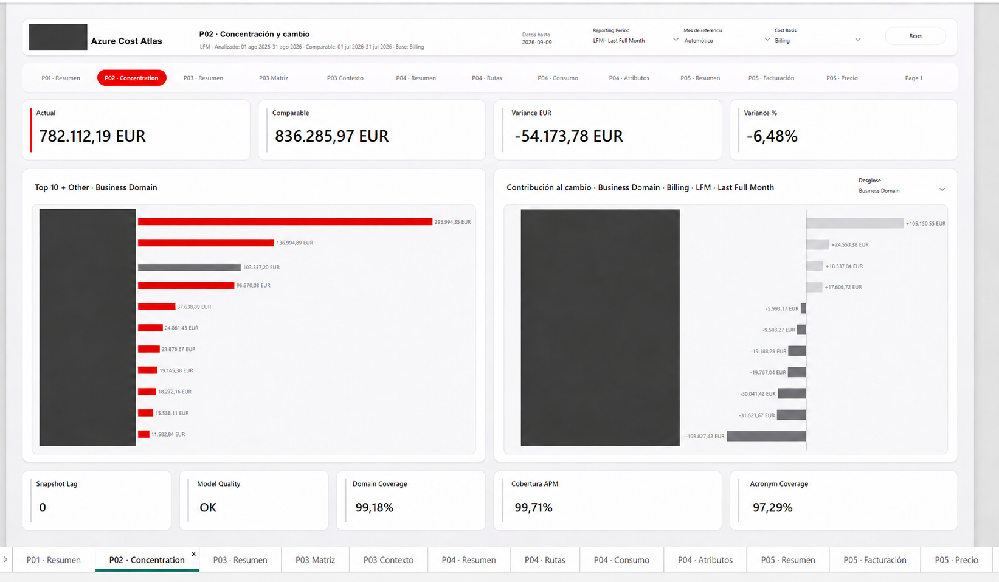

# Azure Cost Atlas

**AI Analytics Engineering portfolio · FinOps · SQL · Semantic modeling · Power BI**

A clean-room public reference edition of a cloud-cost analytics product: turn detailed cost records into a reconciled daily model, preserve the meaning of each cost basis, and make reporting periods explicit when the source is late.

**Start here:** run the offline demo, inspect its SQL and tests, then follow the Power BI build guide. All executable demo values, resource labels and dates are invented. Code and documentation were authored for this public edition. Two separately labeled, owner-authorized redacted historical images provide visual context. No private repository history, corporate exports, unredacted screenshots or configured reports are included.

## Problem and product approach

A cost report can look plausible while double counting snapshots, mixing currencies or units, hiding credits, or presenting missing history as zero. A calendar-driven MTD card can also imply that a new month is available before the source has delivered it.

Azure Cost Atlas makes these contracts visible: one selected snapshot, a received-day coverage manifest, separate Billing / Effective / List readings, a daily fact grain and reconciliation before reporting. Its information architecture moves from overview to cost drivers, applications, cloud composition, and billing detail.

## Engineering evidence and AI positioning

This project supports an **AI Analytics Engineer** portfolio through data contracts, SQL transformations, semantic modeling, validation and product-oriented reporting. **Applied AI and AI-Native Data Products are a direction of development**, supported by these foundations.

**There is no runtime AI in this edition:** no model inference, agent, embedding, RAG, natural-language query engine, forecasting model or automated recommendation. This public reconstruction uses AI-assisted engineering; that describes the development process, not a product feature or a measured productivity gain. Future AI work would require grounded answers, access controls and evaluation before capability claims.

| Product evidence | Inspectable artifact | What is demonstrated | Boundary |
| --- | --- | --- | --- |
| Databricks / SQL | [Aggregation](sql/aggregate.sql), [adaptation guide](docs/databricks.md) | Explicit daily grain and signed reconciliation SQL | SQL executed locally in SQLite; Databricks execution pending |
| Semantic modeling | [Model contract](docs/semantic-model.md), [DAX](powerbi/Measures.dax) | Star schema specification, snapshot and coverage gates, separate bases | DAX source supplied; not evaluated in a Power BI engine here |
| Power BI | [Build guide](powerbi/README.md), [M loader](powerbi/LoadCsv.pq), synthetic CSVs | Rebuildable source-level example | No PBIX or claimed Desktop / Service deployment |
| FinOps | [Metric definitions](docs/semantic-model.md) | Cost transparency, allocation visibility, credit preservation | Differences are not automatically savings; no optimization recommendations |
| Reconciliation | [SQL](sql/reconcile.sql), [29 tests](tests/test_atlas.py) | Daily group, source-row count, money, quantity and credit checks | Synthetic scope only; not reconciliation against invoices |
| UX / information architecture | [Product brief](docs/product-design.md), [wireframe](assets/product-wireframe.svg) | Decision-led navigation and visible freshness / comparison context | Newly authored wireframe, not a historical product screenshot |
| Snapshot-aware reporting | [Offline implementation](src/atlas.py) | Late-source month rollover, MTD, LFM, historical month, missing versus zero | Two invented snapshots; no live refresh scheduler |
| Scale | [Evidence boundaries](docs/evidence.md) | Actual demo counts are reproducible | No enterprise volume, speedup or performance benchmark claim |

## Architecture



[Architecture and data contract](docs/architecture.md) · [Technical decisions](docs/decisions.md) · [Validation](docs/validation.md)

## Run the offline demo

Requires Python 3.10+ with its standard library. No credentials, network, cloud account or third-party packages are used by the demo.

```sh
python src/atlas.py
python -m unittest discover -s tests -v
python scripts/check_publication.py
```

Generated files go to ignored `work/demo/`. Committed reference outputs are in [examples](examples/README.md). To regenerate those intentionally, run `python src/atlas.py --output examples` and review the diff.

Expected results: **476 synthetic source rows → 357 daily analytical rows**, across two overlapping snapshots. These are stored-row counts across the fixture, not distinct usage rows across snapshots. Reconciliation returns zero mismatches. For `DEMO-S2`, Billing MTD (March 1–3, 2025) is **EUR 141.90**, compared with **EUR 141.90** for February 1–3: variance **EUR 0.00**. The January–March fixture is deliberately small; it is not a scale benchmark.

All **29 offline contract tests passed on 2026-09-12**. The SQL, fixture, Python period behavior and export consistency were checked locally. Databricks, Power Query, DAX and Power BI Desktop / Service execution are separate pending gates; see [validation status](docs/validation.md).

## Product walkthrough



Illustrative design specification using the public demo values, **not a Power BI runtime screenshot**. The two snapshots expose a month-boundary scenario: on March 1 the source is complete only through February 28, so March MTD is unavailable and LFM is February. The later snapshot makes March 1–3 available. [Product rationale](docs/product-design.md) explains the page and interaction decisions.

## Redacted historical visual references

These **AI-edited historical references** show the product layout. Branding and internal names are covered; the owner requested retaining the displayed aggregates. These figures are **not synthetic demo results**, and the edited images are not pixel-exact or evidence of Power BI validation. [Provenance and limits](docs/visual-references.md).



P01: overview, current/comparable cost, trend, concentration and coverage context.



P02: ranked concentration and signed contribution to change.

## Repository map

```text
src/atlas.py                 Deterministic data, gates, periods and exports
sql/                        Offline schema, aggregation and reconciliation
tests/                      Executable behavior and corruption tests
examples/                   Invented input, CSV model tables, expected results
powerbi/                    Source-level M/DAX and Desktop build instructions
docs/                       Architecture, decisions, evidence, validation, limits
assets/                     Synthetic wireframe and redacted historical references
scripts/check_publication.py Artifact, link and export consistency checks
.github/                    Pull-request checks and human review template
```

## Limits and publication boundary

This is a deliberately smaller public reconstruction, not a release of a corporate implementation. No cloud connector, incremental refresh, orchestration, access-control enforcement, Service deployment or production performance is validated. Quantity is additive only within a unit; currencies are never combined. The demo uses integer EUR cents and milli-units; real billing precision needs an approved decimal contract before adaptation. It is not a full FOCUS implementation or certified FinOps solution.

Changes are proposed through a PR. **Human review is required before merging to `main`; auto-merge must remain off.** A PR in a public repository is itself public, so only allowlisted public files and the explicitly reviewed redacted images belong in it. [Publication policy](docs/publication.md) specifies the review boundary.

## License

MIT for the newly authored public code and documentation; see [LICENSE](LICENSE). Azure, Databricks and Power BI are third-party products. This independent portfolio project is not endorsed by their vendors.
